  <!-- TOP ANIMATION WITH PANTONE COLORS (P 105-8 C, P 48-8 C, 938 C) -->
  

  <!-- CUSTOM GRAPHIC BANNER -->
  

    

  <!-- TOP BUTTONS -->
  

    
    &nbsp;
    
    &nbsp;
    
  

   

  <!-- BIO + ASCII PORTRAIT -->
  <table>
    <tr>
      <td align="center" valign="middle" width="370">
        
      </td>
      <td valign="middle" width="480">
        <h2>Gabriel Baumgratz</h2>
        
<b>Core Stack:</b> React, React Native, Node.js, Python, Tailwind CSS &amp; AI APIs

      </td>
    </tr>
  </table>

   

  <!-- REAL GITHUB PROJECTS -->
  <h2>GitHub Projects</h2>

  <table>
    <thead>
      <tr>
        <th align="left">Repository</th>
        <th align="left">Description</th>
        <th align="left">Technologies</th>
        <th align="center">GitHub Link</th>
      </tr>
    </thead>
    <tbody>
      <tr>
        <td><b>MEIFLOW</b></td>
        <td>Mobile application built in React Native for microbusiness management, featuring Firebase Auth, Cloud Firestore, PDF reporting, and state management.</td>
        <td><code>React Native</code> <code>Firebase</code> <code>Firestore</code></td>
        <td align="center">
          <a href="https://github.com/gabrielbaumgratz/MEIFLOW"><b>[ Repository ]</b></a>
        </td>
      </tr>
      <tr>
        <td><b>wii-webcam-videogame</b></td>
        <td>Interactive browser game powered by webcam computer vision and real-time motion gesture controls.</td>
        <td><code>JavaScript</code> <code>Webcam API</code> <code>Game Dev</code></td>
        <td align="center">
          <a href="https://github.com/gabrielbaumgratz/wii-webcam-videogame"><b>[ Repository ]</b></a>
        </td>
      </tr>
      <tr>
        <td><b>monitor-surebets</b></td>
        <td>Python automated scraper and tracker for algorithmic sports betting arbitrage opportunities.</td>
        <td><code>Python</code> <code>Web Scraping</code> <code>Data</code></td>
        <td align="center">
          <a href="https://github.com/gabrielbaumgratz/monitor-surebets"><b>[ Repository ]</b></a>
        </td>
      </tr>
      <tr>
        <td><b>Baumfinances</b></td>
        <td>Personal financial management web dashboard for transaction logging and cashflow visibility.</td>
        <td><code>JavaScript</code> <code>Fintech</code> <code>Web</code></td>
        <td align="center">
          <a href="https://github.com/gabrielbaumgratz/Baumfinances"><b>[ Repository ]</b></a>
        </td>
      </tr>
      <tr>
        <td><b>Projeto-Laravel-TTS</b></td>
        <td>Text-to-Speech audio synthesis engine built with Laravel and Blade templates.</td>
        <td><code>PHP</code> <code>Laravel</code> <code>TTS API</code></td>
        <td align="center">
          <a href="https://github.com/gabrielbaumgratz/Projeto-Laravel-Text-to-Speech-Gabriel"><b>[ Repository ]</b></a>
        </td>
      </tr>
    </tbody>
  </table>

   

  <!-- TECH STACK -->
  <h2>Technologies &amp; Skills</h2>

  

    
    
    
    
    
    
    
  

  

    
    
    
    
    
  

    

  

    <a href="./README.md">Voltar para a versão em Português</a>
  

