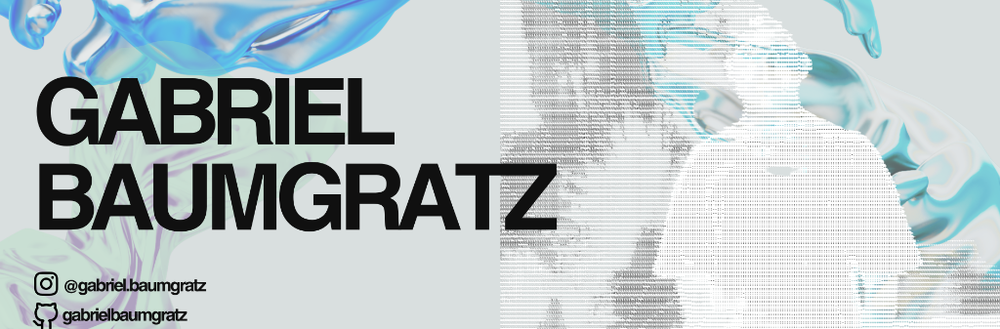

  
  <!-- BANNER GRÁFICO CUSTOMIZADO -->
  

    

  <!-- BOTÕES DAS REDES E PORTFÓLIO NO TOPO -->
  

    
    &nbsp;
    
    &nbsp;
    
  

   

  <!-- APRESENTAÇÃO + FOTO ASCII -->
  <table>
    <tr>
      <td align="center" valign="middle" width="370">
        
      </td>
      <td valign="middle" width="480">
        <h2>Gabriel Baumgratz</h2>
        
<b>Stack Principal:</b> React, React Native, Node.js, Python, Tailwind CSS &amp; APIs de IA

      </td>
    </tr>
  </table>

   

  <!-- PROJETOS REAIS DO GITHUB -->
  <h2>Projetos no GitHub</h2>

  <table>
    <thead>
      <tr>
        <th align="left">Repositório</th>
        <th align="left">Descrição do Projeto</th>
        <th align="left">Tecnologias</th>
        <th align="center">Link GitHub</th>
      </tr>
    </thead>
    <tbody>
      <tr>
        <td><b>MEIFLOW</b></td>
        <td>Aplicativo mobile para gestão de pequenos negócios, com autenticação, relatórios em PDF, Context API e sincronização em nuvem.</td>
        <td><code>React Native</code> <code>Firebase</code> <code>Firestore</code></td>
        <td align="center">
          <a href="https://github.com/gabrielbaumgratz/MEIFLOW"><b>[ Repositório ]</b></a>
        </td>
      </tr>
      <tr>
        <td><b>wii-webcam-videogame</b></td>
        <td>Jogo interativo no navegador controlado por visão computacional e detecção de movimento em tempo real via webcam.</td>
        <td><code>JavaScript</code> <code>Webcam API</code> <code>Game Dev</code></td>
        <td align="center">
          <a href="https://github.com/gabrielbaumgratz/wii-webcam-videogame"><b>[ Repositório ]</b></a>
        </td>
      </tr>
      <tr>
        <td><b>monitor-surebets</b></td>
        <td>Sistema em Python para monitoramento algorítmico, raspagem de dados esportivos e identificação de oportunidades de arbitragem.</td>
        <td><code>Python</code> <code>Web Scraping</code> <code>Data</code></td>
        <td align="center">
          <a href="https://github.com/gabrielbaumgratz/monitor-surebets"><b>[ Repositório ]</b></a>
        </td>
      </tr>
      <tr>
        <td><b>Baumfinances</b></td>
        <td>Aplicação web para controle e organização financeira pessoal com dashboard analítico e acompanhamento de transações.</td>
        <td><code>JavaScript</code> <code>Fintech</code> <code>Web</code></td>
        <td align="center">
          <a href="https://github.com/gabrielbaumgratz/Baumfinances"><b>[ Repositório ]</b></a>
        </td>
      </tr>
      <tr>
        <td><b>Projeto-Laravel-TTS</b></td>
        <td>Serviço de síntese de voz Text-to-Speech (TTS) com processamento de texto e conversão em áudio.</td>
        <td><code>PHP</code> <code>Laravel</code> <code>TTS API</code></td>
        <td align="center">
          <a href="https://github.com/gabrielbaumgratz/Projeto-Laravel-Text-to-Speech-Gabriel"><b>[ Repositório ]</b></a>
        </td>
      </tr>
    </tbody>
  </table>

   

  <!-- GRÁFICOS & INFOGRÁFICOS -->
  <h2>Métricas &amp; Estatísticas</h2>

  

    
    &nbsp;
    
  

  

    
  

   

  <!-- INFOGRÁFICO DE ATIVIDADE DIÁRIA ANIMADA -->
  <h3>Atividade de Contribuições</h3>

  

    

  <!-- TECNOLOGIAS E FERRAMENTAS -->
  <h2>Tecnologias &amp; Habilidades</h2>

  

    
    
    
    
    
    
    
  

  

    
    
    
    
    
  

    

  

    <a href="./README.en.md">Switch to English version</a>
  

