<div align="center">

<!-- 01. HEADER: TERMINAL IDENTITY (ASCII PORTRAIT + SYSTEM INFO) -->
<h3><code>gabriel@terminal ~ $ whoami</code></h3>

<table>
  <tr>
    <td valign="top" width="370">
      
    </td>
    <td valign="top" width="490">
      
    </td>
  </tr>
</table>

<br>

<!-- 02. ACTIVITY: LIVE CONTRIBUTION HEATMAP -->
<h3><code>gabriel@terminal ~ $ ./contributions.sh --year 2026 --animated</code></h3>



<br><br>

<!-- 03. EXECUTIVE SUMMARY -->
<h3><code>gabriel@terminal ~ $ cat overview.log</code></h3>

</div>

```text
[NAME]       Gabriel Baumgratz
[ROLE]       Software Engineer & Interface Designer
[STACK]      Fullstack (Node.js & React), UI/UX (Tailwind & Design Systems), Artificial Intelligence
[STATUS]     Disponivel para projetos freelancers, consultoria e desenvolvimento de software
[WEBSITE]    https://gabrielbaumgratz.vercel.app/
[LOCATION]   Brasil (UTC-3) / Remoto
```

<div align="center">

<br>

<!-- 04. FREELANCE & SERVICES CTA BUTTONS -->
<h3><code>gabriel@terminal ~ $ ./services --status</code></h3>

<table>
  <tr>
    <td align="center" width="50%">
      <b>DISPONIBILIDADE PARA PROJETOS &amp; FREELAS</b><br>
      <sub>Desenvolvimento Web Fullstack, Criacao de Interfaces e Integracoes com IA</sub><br><br>
      <a href="https://gabrielbaumgratz.vercel.app/" target="_blank">
        
      </a>
    </td>
    <td align="center" width="50%">
      <b>CONEXÃO PROFISSIONAL &amp; PROPOSTAS</b><br>
      <sub>Aberto para networking, oportunidades e contratos</sub><br><br>
      <a href="https://www.linkedin.com/in/gabriel-baumgratz-a1a733308/" target="_blank">
        
      </a>
    </td>
  </tr>
</table>

<br>

<!-- 05. PORTFOLIO SHOWCASE: FEATURED PROJECTS -->
<h3><code>gabriel@terminal ~ $ ./portfolio --category all --detailed</code></h3>

<table>
  <thead>
    <tr>
      <th align="left">ID // Projeto</th>
      <th align="left">Arquitetura &amp; Solucao</th>
      <th align="left">Stack Tecnico</th>
      <th align="center">Acesso</th>
    </tr>
  </thead>
  <tbody>
    <!-- PROJETO 01: FULLSTACK & AI -->
    <tr>
      <td>
        <b>[01] Agentic Workflow</b><br>
        <sub>Orquestracao Autonoma</sub>
      </td>
      <td>
        Pipeline de processamento com LLMs (Gemini / OpenAI), streaming de tokens em tempo real, execucao de function calling e integracao com microservicos assincronos.
      </td>
      <td>
        <code>Node.js</code> <code>React</code><br>
        <code>Gemini API</code> <code>Tailwind</code>
      </td>
      <td align="center">
        <a href="https://gabrielbaumgratz.vercel.app/"><code>[Ver no Site]</code></a>
      </td>
    </tr>
    <!-- PROJETO 02: UI/UX & DESIGN SYSTEM -->
    <tr>
      <td>
        <b>[02] Design System Core</b><br>
        <sub>Interface Engine</sub>
      </td>
      <td>
        Biblioteca de componentes web acessiveis (WAI-ARIA), padronizacao tipografica e tokens de design customizados para Tailwind, focando em fluidez e microinteracoes.
      </td>
      <td>
        <code>TypeScript</code> <code>Tailwind</code><br>
        <code>Figma</code> <code>Storybook</code>
      </td>
      <td align="center">
        <a href="https://gabrielbaumgratz.vercel.app/"><code>[Ver no Site]</code></a>
      </td>
    </tr>
    <!-- PROJETO 03: FULLSTACK WEB PLATFORM -->
    <tr>
      <td>
        <b>[03] Platform Hub</b><br>
        <sub>Fullstack Web App</sub>
      </td>
      <td>
        Aplicacao web completa com painel de controle analitico, gerenciamento de estado complexo, autenticacao segura com JWT e camada de cache em memoria.
      </td>
      <td>
        <code>React</code> <code>Node.js</code><br>
        <code>PostgreSQL</code> <code>Express</code>
      </td>
      <td align="center">
        <a href="https://gabrielbaumgratz.vercel.app/"><code>[Ver no Site]</code></a>
      </td>
    </tr>
    <!-- PROJETO 04: BACKEND SERVICE -->
    <tr>
      <td>
        <b>[04] API Gateway &amp; Engine</b><br>
        <sub>Backend Services</sub>
      </td>
      <td>
        Servico RESTful de alto rendimento com arquitetura em camadas, validacao rigorosa de esquemas, documentacao automatizada e testes de integracao continuos.
      </td>
      <td>
        <code>Node.js</code> <code>Express</code><br>
        <code>PostgreSQL</code> <code>Docker</code>
      </td>
      <td align="center">
        <a href="https://gabrielbaumgratz.vercel.app/"><code>[Ver no Site]</code></a>
      </td>
    </tr>
  </tbody>
</table>

<br>

<!-- 06. TECHNICAL STACK & CAPABILITIES -->
<h3><code>gabriel@terminal ~ $ cat stack-manifest.json</code></h3>

</div>

```json
{
  "frontend": [
    "JavaScript (ESNext)",
    "TypeScript",
    "React.js",
    "Next.js"
  ],
  "interface_and_design": [
    "Tailwind CSS",
    "Figma Prototyping",
    "Design Systems",
    "Responsive Layouts",
    "Web Accessibility (a11y)"
  ],
  "backend_and_data": [
    "Node.js",
    "Express",
    "RESTful APIs",
    "PostgreSQL",
    "Database Modeling"
  ],
  "artificial_intelligence": [
    "LLM Integration (Gemini & OpenAI)",
    "Prompt Architecture",
    "Autonomous Agents & Tool Calling",
    "API Automation"
  ],
  "dev_workflow": [
    "Git & GitHub Actions",
    "CI/CD Pipelines",
    "Linux / Shell Scripting"
  ]
}
```

<div align="center">

<br>

<!-- 07. CONNECT & OFFICIAL SOCIAL CHANNELS -->
<h3><code>gabriel@terminal ~ $ ./connect --channels</code></h3>

<table>
  <tr>
    <td align="left">
      <code>[WORK]</code> <b>Site de Freelas &amp; Portfólio</b><br>
      <a href="https://gabrielbaumgratz.vercel.app/" target="_blank">
        
      </a>
    </td>
    <td align="left">
      <code>[NET]</code> <b>LinkedIn Profile</b><br>
      <a href="https://www.linkedin.com/in/gabriel-baumgratz-a1a733308/" target="_blank">
        
      </a>
    </td>
    <td align="left">
      <code>[INST]</code> <b>Instagram</b><br>
      <a href="http://instagram.com/gabriel.baumgratz" target="_blank">
        
      </a>
    </td>
  </tr>
</table>

<br>
<sub>Terminal environment profile — Gabriel Baumgratz — Built with animated SVGs, zero emojis, and automated CI/CD refresh.</sub>

</div>
